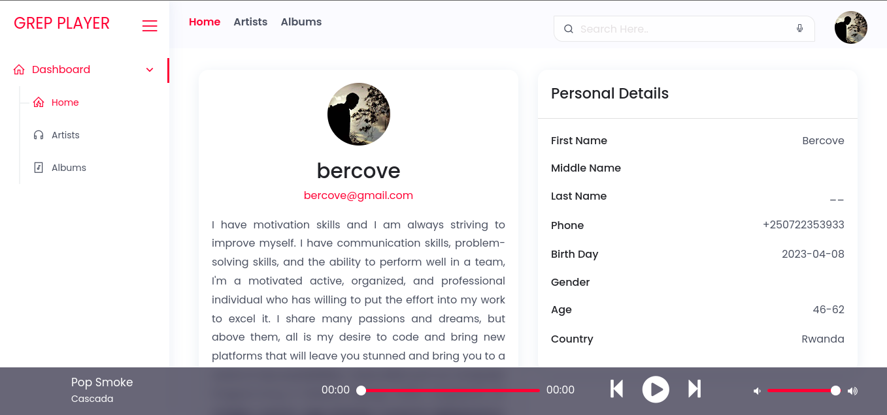

# <center>Grep Player</center>

The goal of this challenge is to build a web application that allows users to
search and view information about music artists and their albums. The
application should have the following features:

- User authentication: users should be able to sign up, login, and logout
using their Google account.
- Artist search: users should be able to search for artists by name and view
their basic information, including their top tracks, albums, and related
artists.
- Album search: users should be able to search for albums by name and view
their basic information, including the artist, release date, and track list.
- Favorite artists and albums: logged-in users should be able to save their
favorite artists and albums to their profile and view them later. All CRUD
functionalities should be implemented respectively.
- User interface: the user interface should be intuitive and user-friendly,
allowing users to perform all of the above sections with ease. You can
choose to use either ReactJS or VueJS for the frontend.

## Instructions

- Create a new Laravel project and set up Google user authentication
- Integrate the last.fm API to allow for artist and album searches. (API
documentation can be found at [Last FM API](https://www.last.fm/api))
- Implement the artist and album search functionalities using Laravel’s built-
in controllers and resource routes. All CRUD functionalities should be
implemented respectively.
- Implement the ability for logged-in users to save their favorite artists and
albums to their profile using Laravel’s built-in authentication system. All
CRUD functionalities should be implemented respectively.
- Implement the user interface using either ReactJS or VueJS.
- Dockerize your project.
- Push your project to your Git and make the repository public.
- Test the application thoroughly to ensure all the features work as
expected.

## Evaluation Criteria
- Proper integration of the Google Sign-in API to allow user authentication.
- Proper integration of the last.fm API to allow for artist and album searches.
- Proper implementation of the artist and album functionalities using
Laravel’s built-in controllers and resource routes.
- Proper implementation of the ability for logged-in users to save their
favorite artists and albums to their profile using Laravel’s built-in
authentication system. Users should be able to add, edit, and delete their
favorite artists and albums.
- Intuitive and user-friendly interface.
- Code quality and readability.
- Proper documentation and commenting in the source code.

## Security Vulnerabilities

If you discover a security vulnerability within Grep Player, please send an e-mail to **Bercove** via [bercove@gmail.com](mailto:bercove@gmail.com). All security vulnerabilities will be promptly addressed.

## License

For open source projects, say how it is licensed. [NONE license](https://github.com/Bercove/GrepPlayer.git).

# <center>How to Run Project</center>
1. Clone Project 
2. Open Terminal or CMD and navigate to root project
3. Create **MySQL Database** `grepplayer`
4. Use the following command to run project
```
php artisan migrate
php artisan run serve
```
5. Open your browser and navigate to `Localhost` [http://localhost:8000](http://localhost:8000)

# <center>Screenshot</center>

<center>Login Form</center>


<center>Personal Information</center>


<center>User Drop Down</center>


<center>User Profile</center>


<center>Search result for album</center>


<center>Search result for artist</center>


<center>Saved Favorite Artist</center>


<center>Deletion of favorite Artist</center>


<center>Saved Favorite Album</center>


<center>Deletion of favorite Album</center>


$$Searching for Artist and Album$$
Use search bar for searching artist and album where it indicate one (1) and the result for Album will appear on two (2) and for Artist will appear on three (3).